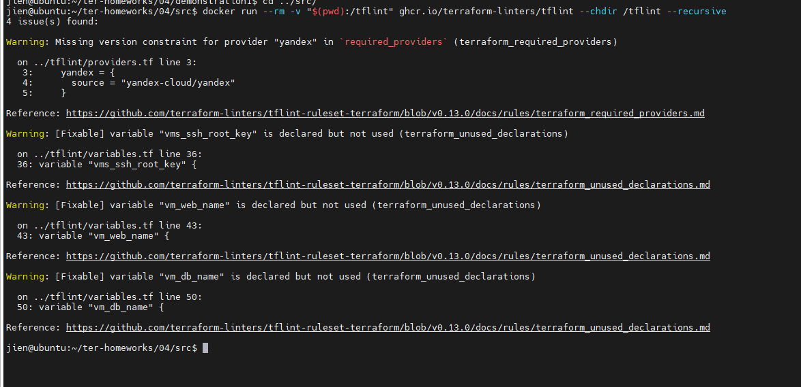
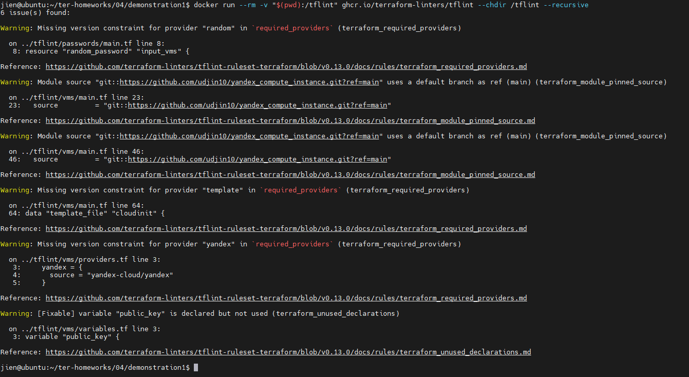
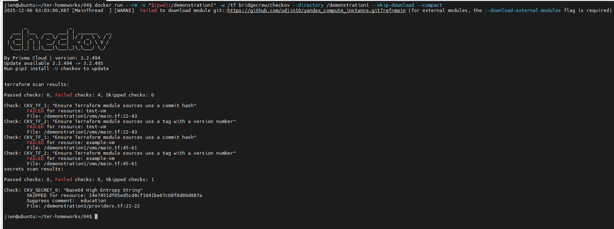
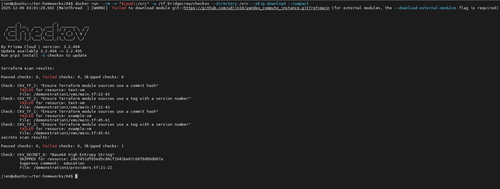
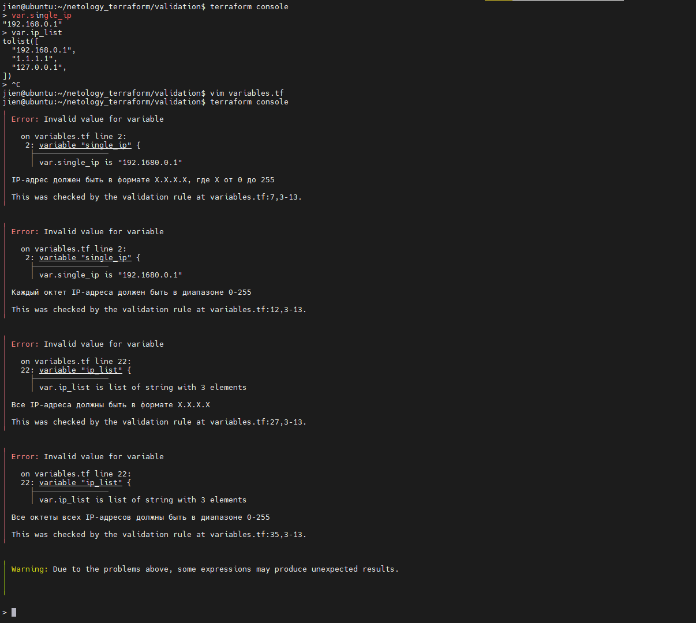

# Домашнее задание к занятию «Использование Terraform в команде»

### Цели задания

1. Научиться использовать remote state с блокировками.
2. Освоить приёмы командной работы.


### Чек-лист готовности к домашнему заданию

1. Зарегистрирован аккаунт в Yandex Cloud. Использован промокод на грант.
2. Установлен инструмент Yandex CLI.
3. Любые ВМ, использованные при выполнении задания, должны быть прерываемыми, для экономии средств.

------
### Внимание!! Обязательно предоставляем на проверку получившийся код в виде ссылки на ваш github-репозиторий!
Убедитесь что ваша версия **Terraform** ~>1.12.0
Пишем красивый код, хардкод значения не допустимы!

------
### Задание 0
1. Прочтите статью: https://neprivet.com/
2. Пожалуйста, распространите данную идею в своем коллективе.

------

### Задание 1

1. Возьмите код:
- из [ДЗ к лекции 4](https://github.com/netology-code/ter-homeworks/tree/main/04/src),
- из [демо к лекции 4](https://github.com/netology-code/ter-homeworks/tree/main/04/demonstration1).
2. Проверьте код с помощью tflint и checkov. Вам не нужно инициализировать этот проект.
3. Перечислите, какие **типы** ошибок обнаружены в проекте (без дублей).

Команды для проверок:

**TFLint:**
```bash
docker run --rm -v "$(pwd):/tflint" ghcr.io/terraform-linters/tflint --chdir /tflint --recursive
```
**Checkov:**
```bash
docker run --rm -v "$(pwd):/checkov" -w /tf bridgecrew/checkov --directory /checkov --skip-download --compact
```









**TFLint ошибки:**
- Отсутствие версий провайдеров - нет version constraints в required_providers
- Использование ветки по умолчанию в модулях - ref=main вместо конкретного тега/коммита
- Неиспользуемые переменные - объявленные переменные не используются

**Checkov ошибки:**
- Модули без фиксированной версии - использование веток вместо хешей/тегов
- Высокоэнтропийные строки - возможные секреты в коде

------

### Задание 2

1. Возьмите ваш GitHub-репозиторий с **выполненным ДЗ 4** в ветке 'terraform-04' и сделайте из него ветку 'terraform-05'.
2. Настройте remote state с встроенными блокировками:
   - Создайте S3 bucket в Yandex Cloud для хранения state (если еще не создан)
   - Создайте service account с правами на чтение/запись в bucket
   - Настройте backend в providers.tf с использованием нового механизма блокировок:
     ```hcl
     terraform {
       required_version = "~>1.12.0"
       
       backend "s3" {
         bucket  = "ваш-bucket-name"
         key     = "terraform.tfstate"
         region  = "ru-central1"
         
         # Встроенный механизм блокировок (Terraform >= 1.6)
         # Не требует отдельной базы данных!
         use_lockfile = true
         
         endpoints = {
           s3 = "https://storage.yandexcloud.net"
         }
         
         skip_region_validation      = true
         skip_credentials_validation = true
         skip_requesting_account_id  = true
         skip_s3_checksum            = true
       }
     }
     ```
   - Выполните `terraform init -migrate-state` для миграции state в S3
   - Предоставьте скриншоты процесса настройки и миграции
3. Закоммитьте в ветку 'terraform-05' все изменения.
4. Откройте в проекте terraform console, а в другом окне из этой же директории попробуйте запустить terraform apply.
5. Пришлите ответ об ошибке доступа к state (блокировка должна сработать автоматически).
6. Принудительно разблокируйте state командой `terraform force-unlock <LOCK_ID>`. Пришлите команду и вывод.

**Примечание:** В Terraform >= 1.6 появился встроенный механизм блокировок через `use_lockfile = true`. 
Это упрощает настройку - больше не нужно создавать отдельную базу данных (YDB в режиме DynamoDB) для хранения блокировок.
Lock-файл создается автоматически в том же S3 bucket рядом с state-файлом с именем `<key>.lock.info`.

------
**2.** ***Создание бакета, создание sa, миграция стейта vpc и vm из local в s3***
- Создал проект storage, в нем реализовал создание бакета и создание sa. В outputs положил ```bucket_name, access_key``` и ```secret_key```. Все три значения нужны в ```providers.tf``` в ```backend "s3"```, но прописать их в файле не получилось. Оказывается нельзя передавать переменные в блок terraform, что на самом деле логично. В блоке terraform (особенно в backend) нельзя использовать data sources, variables или locals - только литералы. Это фундаментальное ограничение Terraform: backend конфигурация должна быть известна ДО выполнения любых data sources. Поэтому, получил значения ```bucket_name, access_key``` и ```secret_key``` для использования во время миграции:
```bash
$ terraform output -raw access_key
<значение access_key>
$ terraform output -raw secret_key
<значение secret_key>
$ terraform output -raw bucket_name
<значение bucket_name> 
```

- Далее перешел в проект vpc. Там реализовал ```terraform_remote_state```. И реализовал ```backend "s3"```. Далее необходимо запустить команду для миграции и передать в нее полученнные ранее  ```bucket_name, access_key``` и ```secret_key```:
```bash
terraform init -migrate-state -backend-config="bucket=<значение bucket_name>" -backend-config="access_key=<значение access_key>" -backend-config="secret_key=<значение secret_key>"
Initializing the backend...
Terraform detected that the backend type changed from "local" to "s3".

Do you want to copy existing state to the new backend?
  Pre-existing state was found while migrating the previous "local" backend to the
  newly configured "s3" backend. No existing state was found in the newly
  configured "s3" backend. Do you want to copy this state to the new "s3"
  backend? Enter "yes" to copy and "no" to start with an empty state.

  Enter a value: yes


Successfully configured the backend "s3"! Terraform will automatically
use this backend unless the backend configuration changes.
Initializing modules...
Initializing provider plugins...
- terraform.io/builtin/terraform is built in to Terraform
- Reusing previous version of hashicorp/aws from the dependency lock file
- Reusing previous version of yandex-cloud/yandex from the dependency lock file
- Using previously-installed hashicorp/aws v6.22.1
- Using previously-installed yandex-cloud/yandex v0.171.0
Terraform has made some changes to the provider dependency selections recorded
in the .terraform.lock.hcl file. Review those changes and commit them to your
version control system if they represent changes you intended to make.

Terraform has been successfully initialized!

You may now begin working with Terraform. Try running "terraform plan" to see
any changes that are required for your infrastructure. All Terraform commands
should now work.

If you ever set or change modules or backend configuration for Terraform,
rerun this command to reinitialize your working directory. If you forget, other
commands will detect it and remind you to do so if necessary.
```

- Далее, делаем тоже самое, что для vpc для проекта vm, используя те же ```bucket_name, access_key``` и ```secret_key```. Но тут есть особенности. В vm уже есть data source ```terraform_remote_state```, он смотрит на local стейт vpc. Нужно сделать так, чтобы теперь он смотрел на тот, что в s3. Меняем это:
```hcl
data "terraform_remote_state" "vpc" {
  backend = "local"

  config = {
    path = "../vpc/network.tfstate"
  }
}
```
На это:
```
data "terraform_remote_state" "vpc" {
  backend = "s3"
  config = {
    bucket  = data.terraform_remote_state.storage.outputs.bucket_name
    key     = "network.tfstate"
    region  = "ru-central1"

    endpoints = {
      s3 = "https://storage.yandexcloud.net"
    }

    access_key = data.terraform_remote_state.storage.outputs.access_key
    secret_key = data.terraform_remote_state.storage.outputs.secret_key

    skip_region_validation      = true
    skip_credentials_validation = true
    skip_requesting_account_id  = true
    skip_s3_checksum            = true
  }
}
```
Далее сделал ```terraform apply```, но получил ответ, что нет никаких изменений для применения. Чтобы измения применились я удалил одну vm:
```bash
terraform destroy -target=module.marketing-vm.yandex_compute_instance.vm[0]
```
Затем ```terraform apply```. В state файле увидел, что теперь ```terraform_remote_state "vpc"```, использует s3.
По идее это плохой вариант. Т.к. я использую:
```hcl
access_key = data.terraform_remote_state.storage.outputs.access_key
secret_key = data.terraform_remote_state.storage.outputs.secret_key
```
а значит они попадут в state файл. Наверно есть лучшие практики.
Остается сделать
```bash
terraform init -migrate-state -backend-config="bucket=<значение bucket_name>" -backend-config="access_key=<значение access_key>" -backend-config="secret_key=<значение secret_key>"
```
**5-6.** ***Блокировка и разблокировка state:***

```bash
jien@ubuntu:~/netology_terraform/vm$ terraform apply
╷
│ Error: Error acquiring the state lock
│
│ Error message: operation error S3: PutObject, https response error StatusCode: 412, RequestID: a03838450eaf05c6, HostID: , api error PreconditionFailed: At least one of the pre-conditions you specified did not
│ hold
│ Lock Info:
│   ID:        c27a9249-e5c3-872b-2c48-2a4fcefbe0aa
│   Path:      simple-bucket-yyemm1tt/vm.tfstate
│   Operation: OperationTypeInvalid
│   Who:       jien@ubuntu.local
│   Version:   1.12.0
│   Created:   2025-12-07 09:45:02.667887228 +0000 UTC
│   Info:
│
│
│ Terraform acquires a state lock to protect the state from being written
│ by multiple users at the same time. Please resolve the issue above and try
│ again. For most commands, you can disable locking with the "-lock=false"
│ flag, but this is not recommended.
╵
jien@ubuntu:~/netology_terraform/vm$ terraform force-unlock c27a9249-e5c3-872b-2c48-2a4fcefbe0aa
Do you really want to force-unlock?
  Terraform will remove the lock on the remote state.
  This will allow local Terraform commands to modify this state, even though it
  may still be in use. Only 'yes' will be accepted to confirm.

  Enter a value: yes

Terraform state has been successfully unlocked!

The state has been unlocked, and Terraform commands should now be able to
obtain a new lock on the remote state.

```

------
### Задание 3  

1. Сделайте в GitHub из ветки 'terraform-05' новую ветку 'terraform-hotfix'.
2. Проверье код с помощью tflint и checkov, исправьте все предупреждения и ошибки в 'terraform-hotfix', сделайте коммит.
3. Откройте новый pull request 'terraform-hotfix' --> 'terraform-05'. 
4. Вставьте в комментарий PR результат анализа tflint и checkov, план изменений инфраструктуры из вывода команды terraform plan.
5. Пришлите ссылку на PR для ревью. Вливать код в 'terraform-05' не нужно.
------
[Ссылка на PR](https://github.com/Jienshakh/netology_terraform/pull/1)
------
### Задание 4

1. Напишите переменные с валидацией и протестируйте их, заполнив default верными и неверными значениями. Предоставьте скриншоты проверок из terraform console. 

- type=string, description="ip-адрес" — проверка, что значение переменной содержит верный IP-адрес с помощью функций cidrhost() или regex(). Тесты:  "192.168.0.1" и "1920.1680.0.1";
- type=list(string), description="список ip-адресов" — проверка, что все адреса верны. Тесты:  ["192.168.0.1", "1.1.1.1", "127.0.0.1"] и ["192.168.0.1", "1.1.1.1", "1270.0.0.1"].

[Ссылка на репозиторий](https://github.com/Jienshakh/netology_terraform/blob/terraform-05-validation/validation/variables.tf)



## Дополнительные задания (со звёздочкой*)

**Настоятельно рекомендуем выполнять все задания со звёздочкой.** Их выполнение поможет глубже разобраться в материале.   
Задания со звёздочкой дополнительные, не обязательные к выполнению и никак не повлияют на получение вами зачёта по этому домашнему заданию. 
------
### Задание 5*
1. Напишите переменные с валидацией:
- type=string, description="любая строка" — проверка, что строка не содержит символов верхнего регистра;
- type=object — проверка, что одно из значений равно true, а второе false, т. е. не допускается false false и true true:
```
variable "in_the_end_there_can_be_only_one" {
    description="Who is better Connor or Duncan?"
    type = object({
        Dunkan = optional(bool)
        Connor = optional(bool)
    })

    default = {
        Dunkan = true
        Connor = false
    }

    validation {
        error_message = "There can be only one MacLeod"
        condition = <проверка>
    }
}
```
------
### Задание 6*

1. Настройте любую известную вам CI/CD-систему. Если вы ещё не знакомы с CI/CD-системами, настоятельно рекомендуем вернуться к этому заданию после изучения Jenkins/Teamcity/Gitlab.
2. Скачайте с её помощью ваш репозиторий с кодом и инициализируйте инфраструктуру.
3. Уничтожьте инфраструктуру тем же способом.


------
### Задание 7*
1. Настройте отдельный terraform root модуль, который будет создавать инфраструктуру для remote state:
   - S3 bucket для tfstate с версионированием
   - Сервисный аккаунт с необходимыми правами (storage.editor)
   - Static access key для сервисного аккаунта
2. Output должен содержать:
   - Имя bucket
   - Access key ID и Secret key (sensitive)
   - Пример конфигурации backend для использования
3. После создания инфраструктуры используйте outputs для настройки backend в основном проекте.

**Примечание:** Так как используется `use_lockfile = true`, создавать YDB/DynamoDB больше не требуется.
Блокировки реализованы встроенным механизмом Terraform и хранятся в том же S3 bucket. 

### Правила приёма работы

Ответы на задания и необходимые скриншоты оформите в md-файле в ветке terraform-05.

В качестве результата прикрепите ссылку на ветку terraform-05 в вашем репозитории.

**Важно.** Удалите все созданные ресурсы.

### Критерии оценки

Зачёт ставится, если:

* выполнены все задания,
* ответы даны в развёрнутой форме,
* приложены соответствующие скриншоты и файлы проекта,
* в выполненных заданиях нет противоречий и нарушения логики.

На доработку работу отправят, если:

* задание выполнено частично или не выполнено вообще,
* в логике выполнения заданий есть противоречия и существенные недостатки. 


